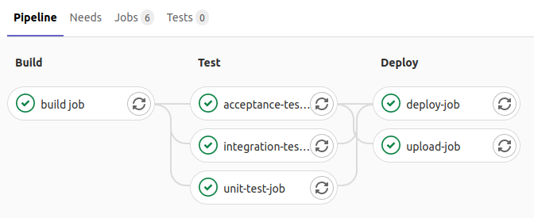

# GitLab Pipelines
{id: pipelines}

## What is GitLab.org?
{id: what-is-gitlab-org}

* [GitLab.org](https://gitlab.org/)
* Open Source Git hosting platform
* "Complete DevOps platform"
* Core is open source and free
* Various add-ons cost money

## What is GitLab.com?
{id: what-is-gitlab-com}

* [GitLab.com](https://gitlab.com/)
* Cloud-based hosting of projects

## ALM-Toolbox
{id: alm-toolbox}

* GitLab licenses in Israel
* Tamir Gefen
* [ALM-Toolbox](https://www.almtoolbox.com/)

## CI - Continuous Integration
{id: continuous-integration}

* Shorten the feedback cycle
* Run on every push

## Documentation
{id: documentation}

* GitLab.org [documentation](https://docs.gitlab.com/)
* GitLab.com specific [documentation](https://docs.gitlab.com/ee/user/gitlab_com/)

## Runner
{id: runner}

* An agent (operating system, VM)
* [shared runners](https://gitlab.com/szabgab/gl-try/-/settings/ci_cd#js-runners-settings)
* Mostly Linux
* Windows is also avilable
* Mac OSX is in beta

## Docker images
{id: docker-images}

* On top of the runner we use Docker images

## .gitlab-ci.yml
{id: gitlab-ci-yml}

* Configuration is in `.gitlab-ci.yml`
* [YAML](https://yaml.org/)

## Pipeline Linter
{id: pipeline-linter}

* CI/CD
* Pipelines
* [CI Lint](https://gitlab.com/szabgab/gl-try/-/ci/lint)

## Hello World
{id: hello-world}


* default (required) - an arbitrary name we used for this job
* script: (required) the command to execute in the Docker container

* Current default Docker image is `ruby:2.5`


## Hello World in container
{id: hello-world-in-container}


* default (required) - an arbitrary name we used for this job
* image: the name of the Docker image, by default from [Docker Hub](https://hub.docker.com/)
* script: (required) the command to execute in the Docker container

## Show what is in the container
{id: show-the-container}


## Pipeline Hierarchy
{id: pipeline-hierachy}


* **Pipeline** Each repository can have a Pipeline (described in the .gitlab-ci.yml file).
* **Stages** Each Pipeline can have one or stages. One stage runs after the previous stage finished.
* **Jobs** Each Stage can have 1 or more jobs. The jobs will run in parallel.
* **Script** Each job must have a `script` and can, optionally, have a `before_script` and an `after_script` step.

## Default Stages
{id: default-stages}

By default there are 3 main stages:


* build
* test
* deploy


## Define stages
{id: define-stages}

* If the 3 standard stages are not good for you, you can defined your own stage-names and order them as you like
* Stage names are free text and can includes spaces.


## Jobs
{id: jobs}

* Each main-key in the yaml file is a "job".
* The job names are free-text (can contain spaces as well)
* There are a few reserved words such as `stages`, `before_script`, `after_script`, and [others](https://docs.gitlab.com/ee/ci/yaml/)

## Set stage of job
{id: set-stage}

* Each job is in one of the stages
* Default stage is called **test**
* It is better to set the stage name explicitely

```
job-name:
  stage: build
```

## Parallel jobs per stage
{id: parallel-jobs-per-stage}




## Manual interaction
{id: manual-interaction}

* [Manual interaction](https://docs.gitlab.com/ee/ci/pipelines/#add-manual-interaction-to-your-pipeline)


## Manual approval
{id: manual-approval}


## Script
{id: script}

* **script:** it is required and it can be a single command or an array of commands
* **before_script** and **after_script** are both optional, but if they exists they must be arrays (even if there is only one element)
* You can have `before_script` and `after_script` as a main-key in the YAML file.
* A job that does not have `before_script` will inherit the central `before_script`. Same with `after_script`.


## Before Script and After Script
{id: before-script-after-script}


## Variables
{id: variables}

* [Variables](https://docs.gitlab.com/ee/ci/variables/)


## extends
{id: extends}

* [extends](https://docs.gitlab.com/ee/ci/yaml/#extends)


## Pick a Docker image
{id: pick-docker-image}

```
job-name:
  image: busybox:latest
```

* Default image is `ruby:2.5` you should really not assume that

## Docker registry of GitLab
{id: gitlab-docker-registry}

* [Docker Container Registry](https://docs.gitlab.com/ee/user/packages/container_registry/)

```
image: registry.gitlab.com/ioanrogers/perl-builder:latest
```

## Run on Windows
{id: run-on-windows}


## Run on Mac OSX
{id: run-on-mac-osx}

* Currently in closed beta

## Interdependence of jobs?
{id: interdependence-of-jobs}

* How can we make one job depende on another one?
* Are stages dependent on each other?
* How to carry the same code from stage to stage?

## Cache
{id: cache}


## Python 3 Virtualenv
{id: python-3-virtualenv}


## Only run job if specific files changed
{id: only-run-job-if-specific-files-changed}
{i: rulse}
{i: changes}


## Artifacts and using them in subsequent jobs
{id: artifacts-and-using-them-in-subsequent-jobs}
{i: artifacts}


